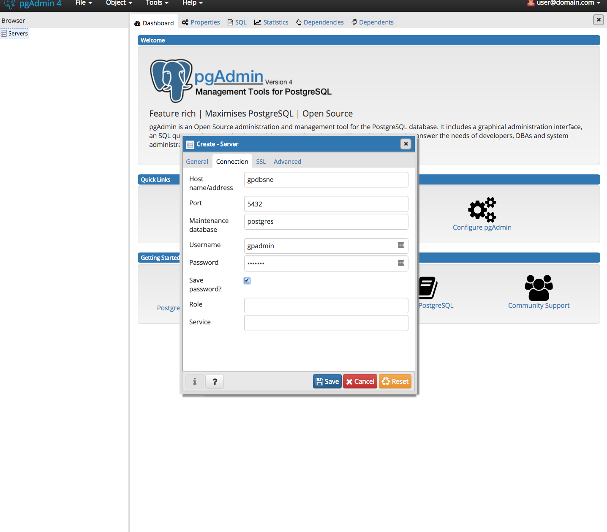

# Greenplum-tutorial
GP的部署学习记录

# greenplum-oss
- pre
    - docker.sh(用big-data仓库的脚本)
- [greenplum-oss-docker](https://github.com/kongyew/greenplum-oss-docker)
    - 使用usecase2
        - cd usecase2
    1. docker-compose -f docker-compose-pgadmin4.yml up -d
    2. docker exec -it gpdbsne bin/bash
    3. su - gpadmin
    4. psql -U gpadmin
    5. \password 
    6. web 连接80端口
    7. Use user@domain.com as username and SuperSecret as password.
    8. You can add new server.
        
    
